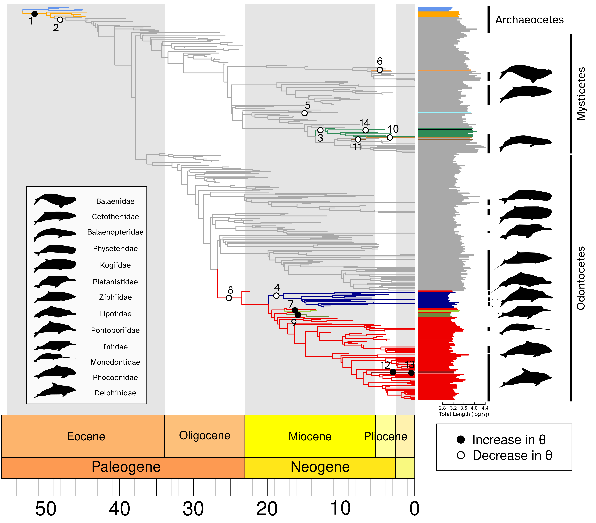

---
# Build settings
theme: slate
---

# The dynamic adaptive landscape of cetacean body size

Authors: [Gustavo Burin\*](gustavo.burin@nhm.ac.uk), Travis Park\*, Tamora D. James, Graham J. Slater, [Natalie Cooper](natalie.cooper@nhm.ac.uk)

[*] These authors contributed equally to this work

This repository contains all the code and data used in the manuscript.

## Data

* `/data` contains the cleaned data used in the analyses, including the phylogeny.

All raw and cleaned data are also available from the [Natural History Museum Data Portal (data.nhm.ac.uk)](https://doi.org/10.5519/vmbrpkuq). 

If you use the cleaned data please cite as follows: 
> Gustavo Burin; Travis Park; Tamora D James; Graham J Slater; Natalie Cooper (2022). Dataset: Data from the “Back to the water” project. Natural History Museum Data Portal (data.nhm.ac.uk). https://doi.org/10.5519/vmbrpkuq.

**Please cite the original sources of the data where possible.**

The phylogeny comes from Lloyd & Slater (2021). **Please cite this paper if you use these data!**

Lloyd, GT, Slater, GJ, 2021. A Total-Group Phylogenetic Metatree for Cetacea and the Importance of Fossil Data in Diversification Analyses. Syst. Biol. 70(5): 922- 939.

-------
## Analyses
The analysis code is divided into subfolders, one for each dataset used. The results are summarized into two `.Rmd` files that generate a PDF with all plots (both from the main text and the supplementary material). A script to generate the base elements for the main figures is also available. The results from bayou are provided into subfolders that follow the same structure as the scripts used to generate them, and the other results (e.g. phylogenetic imputation) are made available through `.RDS` files.

-------
## Other folders

* `output/figs_manuscript` contains the main figures
